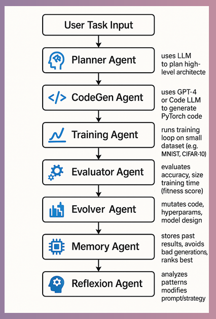

# 🧠 Design and Implementation of a Meta-Learning Based Multi-Agent System for Deep Learning Model Synthesis and Architecture Mutation

## 📖 Overview

This project presents a Meta-Learning Based Multi-Agent System that automates the design, training, evaluation, and evolution of deep learning architectures. Instead of manually creating neural networks, the system leverages autonomous agents that collaborate to generate, optimize, mutate, and evaluate models for image classification tasks.

The framework demonstrates how multiple AI agents can work together to perform Neural Architecture Search (NAS) and model optimization, reducing human effort while improving model performance through iterative evolution.

---

## ✨ Key Features

### 🤖 Multi-Agent System

* **Planner Agent** – Generates sophisticated neural network architectures using intelligent architecture planning.
* **CodeGen Agent** – Produces optimized PyTorch model definitions and training workflows.
* **Training Agent** – Handles model training, validation, and optimization processes.
* **Evaluator Agent** – Computes performance metrics such as accuracy and loss.
* **Evolver Agent** – Mutates neural architectures using evolutionary search strategies inspired by NEAT concepts.
* **Memory Agent** – Stores successful model configurations and architecture histories for future reference.
* **Reflexion Agent** – Refines architecture generation strategies through iterative feedback and self-improvement.

### 🧠 Meta-Learning Capabilities

* Automated Neural Architecture Generation
* Architecture Mutation and Evolution
* Performance-Based Model Selection
* Iterative Optimization and Self-Improvement
* Multi-Agent Collaboration Framework
* Adaptive Learning Strategies

---

## 🛠️ Technology Stack

### Programming Language

* Python

### Deep Learning Framework

* PyTorch
* TorchVision

### AI & ML Concepts

* Meta-Learning
* Neural Architecture Search (NAS)
* Evolutionary Algorithms
* Multi-Agent Systems
* Deep Learning Optimization

### Dataset

* MNIST Handwritten Digit Dataset

---

## 📁 Project Structure

```text
Meta-Learning-Multi-Agent-System/
│
├── data/                 # Dataset storage
├── images/               # Architecture diagrams and screenshots
├── app.py                # Main application
├── requirements.txt      # Dependencies
├── README.md             # Documentation
└── .gitignore            # Ignored files and folders
```

---
## System Architecture




## 🚀 Installation & Setup

### 1. Clone the Repository

```bash
git clone https://github.com/your-username/meta-learning-multi-agent-system.git

cd meta-learning-multi-agent-system
```

### 2. Create Virtual Environment (Recommended)

#### Windows

```bash
python -m venv venv

venv\Scripts\activate
```

#### Linux / macOS

```bash
python -m venv venv

source venv/bin/activate
```

### 3. Install Dependencies

```bash
pip install torch torchvision
```

Or

```bash
pip install -r requirements.txt
```

### 4. Run the Application

```bash
python app.py
```

---

## ⚙️ System Workflow

```text
Planner Agent
      ↓
CodeGen Agent
      ↓
Training Agent
      ↓
Evaluator Agent
      ↓
Evolver Agent
      ↓
Memory Agent
      ↓
Reflexion Agent
      ↓
Improved Architecture Generation
```

The process continues iteratively until high-performing neural architectures are discovered.

---

## 📊 Results

### Achievements

* Successfully generated deep learning architectures automatically.
* Trained and evaluated neural networks on the MNIST dataset.
* Demonstrated architecture mutation and optimization.
* Improved model performance through iterative evolutionary cycles.
* Showcased the effectiveness of multi-agent collaboration in Neural Architecture Search.

---

## 🔬 Applications

This framework can be extended for:

* Automated Machine Learning (AutoML)
* Neural Architecture Search (NAS)
* Deep Learning Optimization
* Evolutionary AI Systems
* Agentic AI Research
* Adaptive Model Design

---

## 🔮 Future Enhancements

### Advanced Multi-Agent Intelligence

* LLM-Powered Planning Agents
* Autonomous Code Generation
* Self-Healing Training Pipelines
* Distributed Agent Collaboration

### Evolutionary Framework

* Integration with DEAP
* Genetic Algorithms
* Population-Based Training
* Advanced Mutation Strategies

### Memory & Knowledge Base

* ChromaDB Integration
* Architecture Knowledge Graph
* Long-Term Learning Memory

### Visualization Dashboard

* Streamlit Dashboard
* Architecture Visualization
* Performance Tracking
* Real-Time Evolution Monitoring

### Dataset Expansion

* CIFAR-10
* CIFAR-100
* Fashion-MNIST
* ImageNet
* Custom Datasets

### Multi-Objective Optimization

Optimization based on:

* Accuracy
* FLOPs
* Inference Latency
* Memory Consumption
* Energy Efficiency

### Cloud Deployment

* Docker Support
* Kubernetes Deployment
* Distributed Training
* GPU Cluster Execution

---

## 🎯 Research Significance

This project demonstrates how Meta-Learning, Evolutionary Computation, and Multi-Agent Systems can be combined to automate deep learning model design. The framework serves as a foundational step toward fully autonomous AI systems capable of discovering and optimizing neural architectures with minimal human intervention.

---

## 👩‍💻 Author

**Bhoomika Subramanya**

CSE (Artificial Intelligence & Machine Learning)
JSS Academy of Technical Education, Bengaluru

---

## 📄 License

This project is developed for educational, research, and experimental purposes. Feel free to extend and enhance the framework for advanced Neural Architecture Search and Multi-Agent AI research.
